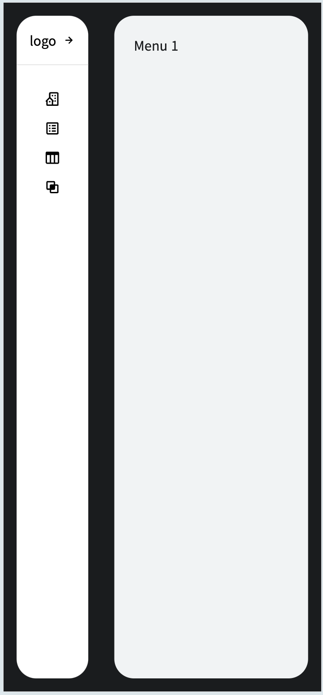

# 개요

  
Next.js App Router와 Tailwind CSS를 사용하여 작성된 반응형 레이아웃 컴포넌트입니다.  
이 컴포넌트는 접이식 사이드바와 메인 콘텐츠 영역을 포함하고 있으며, Context API를 통해 사이드바의 상태를 관리합니다. 사용자는 메뉴와 페이지와 연결된 Router를 통한 페이지 이동을 할 수 있습니다.    

# 주요 기능

### App Router(Nextjs)

- 페이지 전환: 각 메뉴 항목은 Next.js의 Link 컴포넌트를 사용하여 다른 페이지로 라우팅 됩니다.
- 자동화된 라우팅: 페이지는 pages 디렉토리에 파일을 추가하는 것만으로 자동으로 라우팅됩니다.

### Context API Provider

- 사이드바 상태 관리: Context API를 사용하여 사이드바의 확장 및 축소 상태를 전역에서 관리합니다.
- 토글 기능: 사용자가 사이드바를 확장하거나 축소할 수 있는 기능을 제공합니다.

### 메뉴 및 페이지 전환

- 동적 메뉴: 사이드바 메뉴 항목을 클릭하면 해당 페이지로 이동합니다.
- 메뉴 제목 변경: 선택된 메뉴에 따라 사이드바의 제목이 동적으로 변경됩니다.

### 반응형 디자인

- 모바일 퍼스트 전략의 tailwindCSS를 통한 반응형 디자인 적용
- 자동 축소/확장: 화면 크기에 따라 사이드바가 자동으로 축소되거나 확장됩니다. 768px 이하의 화면에서는 사이드바가 자동으로 축소되고, 그 이상의 화면에서는 확장됩니다.
- 이벤트 리스너: 윈도우 크기 변경 시 사이드바 상태를 업데이트하는 이벤트 리스너를 사용합니다.
